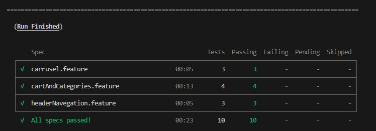

# 🚀 Proyecto de Pruebas Automatizadas con Cypress + Cucumber

Pruebas E2E para DemoBlaze utilizando **Cypress**, **Cucumber** y el patrón **Page Object Model**.

## 📂 Estructura del Proyecto

```
cypress-practicalIntegral/
├── cypress/
│   ├── integration/
│   │   ├── cartAndCategories/
│   │   │   ├── cartAndCategories.js
│   │   │   └── cartAndCategories.feature
│   │   ├── headerNavigation/
│   │   │   ├── headerNavigationSteps.js
│   │   │   ├── carrusel.feature
│   │   │   ├── cartAndCategories.feature
│   │   │   └── headerNavigation.feature
│   │   └── plugins/
│   │       └── index.js
│   ├── screenshots/
│   ├── support/
│   │   └── pageObjects/
│   │       ├── CartPage.js
│   │       ├── CategoryPage.js
│   │       ├── commands.js
│   │       ├── HeaderPage.js
│   │       ├── HomePage.js
│   │       └── index.js
│   └── videos/
├── node_modules/
├── .gitignore
├── cypress.json
├── package-lock.json
├── package.json
└── README.md
```

## 🖥️ Entorno Técnico

- **Node.js**: v16+
- **npm**: v8+
- **Cypress**: 9.7.0
- **cypress-cucumber-preprocessor**: 4.3.1
- **cypress-xpath**: 2.0.1
- **IDE Recomendado**: Visual Studio Code

## ⚙️ Configuración Principal

### cypress.json
```json
{
    "baseUrl": "https://www.demoblaze.com/",
    "testFiles": "**/*.feature"
}
```

### package.json (Dependencias)
```json
{
  "devDependencies": {
    "cypress": "^9.7.0",
    "cypress-cucumber-preprocessor": "4.3.1",
    "cypress-xpath": "^2.0.1"
  },
  "cypress-cucumber-preprocessor": {
    "nonGlobalStepDefinitions": true
  }
}
```

### plugins/index.js
```javascript
const cucumber = require('cypress-cucumber-preprocessor').default

module.exports = (on, config) => {
  on('file:preprocessor', cucumber())
}
```

### support/index.js
```javascript
import './pageObjects/commands'
require('cypress-xpath')
```

## 🧩 Frameworks y Patrones

1. **Cypress** - Framework principal de testing E2E
2. **Cucumber** - BDD con sintaxis Gherkin
3. **Page Object Model** - Patrón de diseño para organización del código
4. **XPath** - Localizadores avanzados para elementos web

## 🚀 Instalación y Configuración

### Prerequisitos
```bash
# Verificar versión de Node.js
node --version

# Verificar versión de npm
npm --version
```

### Instalación
```bash
# Clonar el repositorio
git clone [URL_DEL_REPOSITORIO]

# Navegar al directorio
cd cypress-practicalIntegral

# Instalar dependencias
npm install
```

## ▶️ Comandos de Ejecución

### Ejecución Completa
```bash
# Ejecutar todas las pruebas en modo headless
npx cypress run

# Abrir Cypress Test Runner (modo interactivo)
npx cypress open
```

### Ejecución Específica
```bash
# Ejecutar por archivo específico
npx cypress run --spec "cypress/integration/carrusel/*.feature"

# Ejecutar por tags (si están configurados)
npx cypress run --env TAGS="@smoke"
```

## 📋 Funcionalidades Testeadas

### Carrusel
- Navegación entre elementos del carrusel
- Validación de imágenes y contenido

### Carrito y Categorías
- Agregar productos al carrito
- Navegación por categorías
- Validación de productos

### Navegación del Header
- Links de navegación principales
- Funcionalidad de menús
- Validación de redirecciones

## 🔧 Configuración VS Code

### Extensiones Recomendadas
- **Cucumber (Gherkin)** - Syntax highlighting para archivos .feature
- **Cypress Helper** - Autocompletado para comandos Cypress
- **ESLint** - Linting de código JavaScript

### settings.json
```json
{
  "cucumberautocomplete.steps": [
    "cypress/integration/**/*.js"
  ]
}
```

## 📄 .gitignore
```
node_modules/
cypress/screenshots/
cypress/videos/
.DS_Store
```

## 🎥 Demo Visual
<div align="center">
  <a href="https://youtu.be/NiTVavgMVq4">
    
  </a>
  <p><em>Video: Pruebas de Carrusel y Checkout</em></p>
</div>


## 📸 Screenshots - Salida por terminal al correr npx cypress run Cucumber



---
**Desarrollado con Cypress + Cucumber para testing automatizado E2E**
